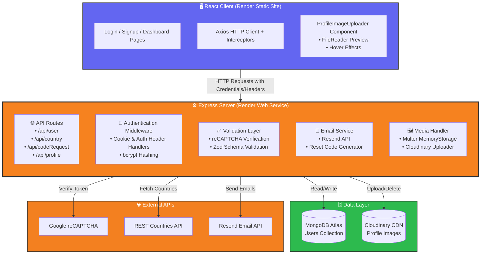

# Authentication-User-Dashboard-App

⭐ A production‑style full‑stack authentication system demonstrating secure user workflows, media uploads, and real‑world backend architecture.

A full‑stack authentication and user dashboard application built with **Node.js (Express)**, **MongoDB**, and **React**. This project implements secure authentication flows, CAPTCHA protection, **Cloudinary image upload**, interactive maps, and third‑party API integrations used in real‑world web applications.

[](LICENSE)
[](https://nodejs.org/)
[](https://expressjs.com/)
[](https://reactjs.org/)
[](https://vitejs.dev/)
[](https://mongodb.com/)
[](https://mongoosejs.com/)
[](https://jwt.io/)
[](https://cloudinary.com/)
[](https://developers.google.com/maps)
[](https://www.google.com/recaptcha/)
[](https://axios-http.com/)
[](https://getbootstrap.com/)
[]()

---

## Table of Contents
- [Overview](#overview)
- [Deployment](#deployment)
- [Why This Project Exists](#why-this-project-exists)
- [Usage Example](#usage-example)
- [Architecture](#architecture)
- [Features](#features)
- [Tech Stack](#tech-stack)
- [Environment Variables](#environment-variables)
- [Project Structure](#project-structure)
- [Authentication Flows](#authentication-flows)
- [API Endpoints](#api-endpoints)
- [Roadmap](#roadmap)
- [License](#license)

---

## Overview

This application implements a secure authentication system with:

- User signup with **email verification** (6-digit code, 10-minute TTL)
- CAPTCHA‑protected login
- Password reset via email verification code
- **Profile image upload** with Cloudinary CDN storage
- **Cross-Domain Adaptive Auth:** JWT strategies parsing both `HttpOnly Cookies` (SameSite: None) and dynamic fallback `Authorization headers`
- Protected user dashboard with profile management
- Country selection with live Google Maps preview
- **Interactive map** that auto-zooms to selected country

The goal is to simulate a realistic, production‑ready authentication architecture with modern media handling capabilities.

## Deployment
🚀 **Live Production Environment:** [https://authentication-user-dashboard-app.onrender.com](https://authentication-user-dashboard-app.onrender.com)

This application is fully decoupled and distributed globally on **Render**:
* **Frontend Client Layer:** Hosted as a managed Static Site tracking production distribution bundles.
* **Backend Application Layer:** Hosted as an active Web Service running modern, containerized Node.js environments linked up directly to a cloud **MongoDB Atlas** database cluster.
* **Media Storage:** User-uploaded profile images are stored and served via **Cloudinary** CDN for optimal performance.

---

<div align="center">
  
</div>
<div align="center">
  <em>Demonstration of signup with country selection and profile image upload</em>
</div>

---

## Why This Project Exists

This project is a **portfolio centerpiece** showcasing my full‑stack capabilities:

| Area | What I Demonstrated |
|------|---------------------|
| **Backend** | Express REST API, JWT auth, bcrypt hashing, Nodemailer, Zod validation, Multer file handling |
| **Frontend** | React components, React Router, Axios interceptors, Bootstrap, Leaflet map embed, FileReader API |
| **Security** | HttpOnly cookies, Cross-Origin Cookie management, reCAPTCHA v2, email verification with bcrypt-hashed time-limited codes, input validation, XSS prevention |
| **Media Management** | Cloudinary CDN integration, profile picture upload/delete, image optimization, Multer middleware |
| **Integrations** | REST Countries API, Google reCAPTCHA, Resend / SMTP email service, Cloudinary |
| **Database** | MongoDB schema design, Mongoose ODM, user data persistence, TTL for verification codes |
| **DevOps** | Decoupled cross-origin cloud environments, Environment orchestration, CORS configuration |

---

## Usage Example

1. **Sign up** – Enter your details, upload a profile picture (optional), and choose a country — the map auto‑zooms to your selection.
2. **Verify your email** – A 6-digit code is sent to your inbox. Enter it to confirm your address before your account is created.
3. **Log in** – Solve the reCAPTCHA, receive a secure session handshake via `httpOnly` cookie.
4. **Dashboard** – View your complete profile including email, username, country, join date, and profile image.
5. **Reset your password** – Request a 6‑digit verification code by email, verify it, then set a new password.
6. **Update profile** – Change your profile picture (upload new or delete existing).

---

## Architecture


## Features


### 🔐 Authentication & Security
- **Adaptive Core Authentication** – Password hashing (bcrypt), multi-channel JWT evaluation via HttpOnly cookie extraction alongside synchronous Authorization: Bearer extraction.
- **Email Verification** – 6-digit code sent via Resend API on signup. Codes are bcrypt-hashed server-side and expire after 10 minutes. Unverified accounts cannot log in.
- **CAPTCHA Protection** – Google reCAPTCHA v2 on login to prevent automated brute-force scripts.
- **Dual-Channel Session Handshake** – Server stores JWT in encrypted httpOnly cookie while simultaneously returning it in JSON response for flexible client handling.
- **Server‑Side Validation** – Robust input scrubbing using runtime Zod schemas with detailed error messages.

### 👤 User Management
- **Password Reset Flow** – Time‑limited 6‑digit codes sent securely via Resend email API.
- **Interactive Dashboard** – Dynamic profile fetching with loading states and graceful error handling.
- **Profile Image Upload** – Upload, preview (with FileReader), and delete profile pictures stored on Cloudinary CDN.
- **Default Avatar Generation** – UI Avatars API fallback when no custom image is uploaded.

### 🗺️ Location & Maps
- **Country Integration** – Dynamic country list parsed from REST Countries API.
- **Live Map Preview** – Leaflet Maps embed that auto-zooms to selected country coordinates.
- **Async Coordinate Fetching** – Country selection triggers background API call to update map viewport.

### 🎨 UI/UX Highlights
- **Polished Image Uploader** – Hover effects with SVG overlay, smooth transitions, and click-to-upload interaction.
- **Responsive Design** – Bootstrap-powered layouts that work on desktop and mobile.
- **Loading States** – Spinners and disabled buttons during async operations to prevent double submission.
- **Form Validation** – Real-time validation feedback with Bootstrap's isInvalid prop.


## Tech Stack


| Layer          | Technologies                                                                 |
|----------------|------------------------------------------------------------------------------|
| **Frontend**   | React 18, Vite, React Bootstrap, React Router, Axios, FileReader API |
| **Backend**    | Node.js, Express 5, MongoDB (Mongoose 9), JWT, bcrypt, Zod, Resend, CORS, Multer |
| **Media**      | Cloudinary CDN (image upload, storage, optimization)                         |
| **Security**   | Google reCAPTCHA v2, httpOnly cookies, bcrypt hashing, input sanitization    |
| **APIs**       | REST Countries API, Google Maps JavaScript API, Google reCAPTCHA API, Resend Email API |


---

## Environment Variables

### Backend (`server/.env`)

```env
MONGODB_URI=mongodb+srv://...
JWT_SECRET=super_secret_key_here
CLOUDINARY_CLOUD_NAME=cloud_name
CLOUDINARY_API_KEY=123456789012345
CLOUDINARY_API_SECRET=api_secret
CAPTCHA_SECRET=recaptcha_secret_key
RESEND_API_KEY=re_123456789
PORT=3000
```


| Variable | Description |
|----------|-------------|
| `MONGODB_URI` | MongoDB Atlas connection string |
| `JWT_SECRET` | Strong cryptographic secret for signing JWTs |
| `CLOUDINARY_CLOUD_NAME` | Cloudinary cloud name for image uploads |
| `CLOUDINARY_API_KEY` | Cloudinary API key |
| `CLOUDINARY_API_SECRET` | Cloudinary API secret |
| `CAPTCHA_SECRET` | Google reCAPTCHA secret server key |
| `RESEND_API_KEY` | Resend email service API key |
| `PORT` | Execution port (Defaults to 3000) |


### Frontend (`client/.env`)

```env
VITE_REACT_APP_RECAPTCHA_SITE_KEY=6LeIxAcTAAAAAJcZ...
VITE_GOOGLE_MAPS_API_KEY=AIzaSy...
VITE_REACT_APP_API_BASE_URL=https://backend-domain.onrender.com/api
```

| Variable | Description |
|----------|-------------|
| `VITE_REACT_APP_RECAPTCHA_SITE_KEY` | Google reCAPTCHA public site key |
| `VITE_REACT_APP_API_BASE_URL` | Base production endpoint of the backend API |


---

## Project Structure

```text
├── client/                            # React frontend (Served via Render Static Site)
│   ├── src/
│   │   ├── api/                          # Configured Axios client + API abstractions
│   │   │   ├── apiClient.js               # Axios instance with auth interceptor
│   │   │   ├── userApi.js                 # User CRUD operations
│   │   │   ├── countryApi.js              # Country data fetching
│   │   │   └── reqCodeApi.js              # Password reset endpoints
│   │   ├── assets/                       # Static images & fallback avatars
│   │   ├── components/                   # Reusable UI components
│   │   │   ├── ProfileImageUploader.jsx   # Image upload with preview
│   │   │   ├── CountrySelector.jsx        # Dynamic country dropdown
│   │   │   ├── AccountFields.jsx          # Password validation fields
│   │   │   ├── SignupMap.jsx              # Google Maps integration
│   │   │   ├── RecaptchaComponent.jsx     # Google reCAPTCHA wrapper
│   │   │   ├── Login.jsx                  # Login form component
│   │   │   ├── Signup.jsx                 # Signup form component
│   │   │   ├── ReqResetCard.jsx           # Password reset request
│   │   │   ├── ResetPassword.jsx          # New password form
│   │   │   └── pageContainer.jsx          # Shared layout wrapper
│   │   ├── pages/                        # Route-level page components
│   │   │   ├── loginPage.jsx
│   │   │   ├── signupPage.jsx
│   │   │   ├── homePage.jsx
│   │   │   ├── forgotPasswordPage.jsx
│   │   │   └── resetPasswordPage.jsx
│   │   ├── App.jsx                       # Router configuration
│   │   └── main.jsx                      # Entry point
│   ├── .env
│   └── package.json
│
├── server/                            # Express backend (Served via Render Web Service)
│   ├── middleware/                       # Custom middleware
│   │   └── auth.js                        # JWT verification (cookie + header)
│   ├── models/                           # Mongoose schemas
│   │   ├── user.js                        # User model with password hashing
│   │   └── userZSchema.js                 # Zod validation schemas
│   ├── routes/                           # API route handlers
│   │   ├── user.js                        # Signup, login, logout, /me
│   │   ├── country.js                     # Country list and coordinates
│   │   ├── codeRequest.js                 # Email verification & password reset flow
│   │   └── profileImage.js                # Cloudinary upload/delete
│   ├── controllers/                      # Business logic
│   │   └── emailSender.js                 # Resend email integration
│   ├── .env
│   └── index.js                          # Server entry point & middleware setup
│
└── README.md
```

## Authentication Flows


### Signup & Email Verification
1. User provides email, username, password, and selects a country.
2. Optionally uploads a profile picture (preview generated via FileReader).
3. Country selection triggers REST Countries API to fetch coordinates and update the map viewport.
4. On submit, a 6-digit verification code is generated, **bcrypt-hashed**, and stored with a **10-minute TTL**.
5. Code is sent to the user's email via Resend API.
6. User enters the code on the verification screen — server validates the hash and flips `email_verified` to `true`.
7. Account is fully created: password is bcrypt-hashed, default avatar generated via UI Avatars API.
8. If a profile image was selected, it is uploaded to Cloudinary via multipart/form-data.
9. JWT is issued via httpOnly cookie + JSON response. User is redirected to dashboard.

### Login & Handshake
1. User supplies email + password + solves reCAPTCHA v2.
2. Server validates reCAPTCHA token with Google's API.
3. Unverified accounts (`email_verified: false`) are rejected with a `403`.
4. Credentials verified against bcrypt-hashed password in MongoDB.
5. **Dual Channel Handshake:** Server stores JWT inside encrypted httpOnly cookie (secure, SameSite=None) while simultaneously returning token via JSON response.
6. Frontend stores token in localStorage as fallback for API calls.
7. Axios interceptor automatically adds `Authorization: Bearer <token>` header when cookie is unavailable.

### Profile Image Management
1. User clicks on profile image area in signup form.
2. File picker opens, accepts JPEG, PNG, WEBP (max 5MB).
3. Frontend generates preview using FileReader API.
4. On form submission, image is uploaded separately via multipart/form-data.
5. Backend validates file type/size using Multer.
6. Image uploaded to Cloudinary with automatic optimization (webp conversion, 500x500 limit).
7. Old profile image (if exists) is deleted from Cloudinary before the new one is stored.
8. User can delete image at any time, reverting to an auto-generated UI Avatar.

### Password Reset
1. User requests password reset with email address.
2. Server generates 6-digit code, **bcrypt-hashes** it, stores with **10-minute TTL**.
3. Code sent via Resend email API to user's inbox.
4. User enters 6-digit code on verification screen.
5. Server validates code and issues a time-limited JWT reset token (15-minute expiry).
6. User sets new password, which is bcrypt-hashed and saved.
7. Verification code is cleared from database.


---

## API Endpoints


| Method | Endpoint                           | Description                              | Auth Required |
|--------|------------------------------------|------------------------------------------|---------------|
| POST   | `/api/user/createUser`             | Complete registration after verification | No            |
| POST   | `/api/user/loginUser`              | Login + reCAPTCHA validation             | No            |
| GET    | `/api/user/me`                     | Get profile (Cookie / Header)            | **Yes**       |
| POST   | `/api/user/logout`                 | Clear session & cookie                   | **Yes**       |
| DELETE | `/api/user/delete`                 | Permanently delete account               | **Yes**       |
| POST   | `/api/profile/upload-profile-image`| Upload profile image to Cloudinary       | **Yes**       |
| DELETE | `/api/profile/delete-profile-image`| Delete profile image                     | **Yes**       |
| POST   | `/api/codeRequest`                 | Send verification code (signup or reset) | No            |
| POST   | `/api/codeRequest/verifyCode`      | Validate code, get reset token or verify email | No     |
| POST   | `/api/codeRequest/resetPassword`   | Set new password with reset token        | No (token)    |
| GET    | `/api/country/all`                 | Get all country names                    | No            |
| GET    | `/api/country/:value`              | Get lat/lng coordinates for country      | No            |


---

## Roadmap

- [ ] Add rate-limiting middleware for authentication routes (express-rate-limit)
- [ ] Migrate verification codes from MongoDB to Redis with TTL
- [ ] Add "Forgot Password" rate limiting and account lockout
- [ ] Implement refresh token rotation for enhanced security
- [ ] Add unit and integration tests (Jest + Supertest)
- [ ] Convert project to TypeScript for type safety
- [ ] Add CI/CD pipeline with GitHub Actions


---

## License


This project is licensed under the MIT License. See the LICENSE file for details.


---

## About


Built by [Mel000000](https://github.com/Mel000000) – a production‑style authentication demo with real‑world security patterns, media management, and third-party integrations.
