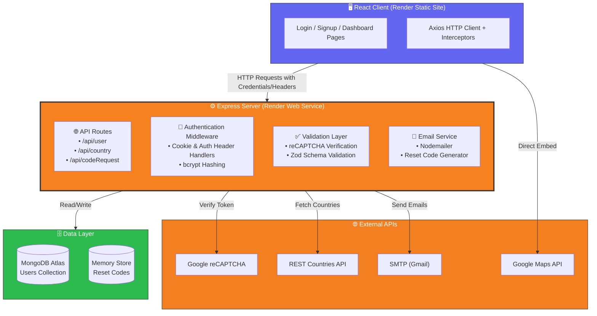

# Authentication-User-Dashboard-App

⭐ A production‑style full‑stack authentication system demonstrating secure user workflows and real‑world backend architecture.

A full‑stack authentication and user dashboard application built with **Node.js (Express)**, **MongoDB**, and **React**. This project implements secure authentication flows, CAPTCHA protection, and third‑party API integrations used in real‑world web applications.

[](LICENSE)
[](https://nodejs.org/)
[](https://expressjs.com/)
[](https://reactjs.org/)
[](https://vitejs.dev/)
[](https://mongodb.com/)
[](https://mongoosejs.com/)
[](https://jwt.io/)
[](https://axios-http.com/)
[](https://getbootstrap.com/)
[]()

---

## Table of Contents
- [Overview](#overview)
- [Deployment](#deployment)
- [Why This Project Exists](#why-this-project-exists)
- [Usage Example](#usage-example)
- [Architecture](#architecture)
- [Features](#features)
- [Tech Stack](#tech-stack)
- [Environment Variables](#environment-variables)
- [Project Structure](#project-structure)
- [Authentication Flows](#authentication-flows)
- [API Endpoints](#api-endpoints)
- [Roadmap](#roadmap)
- [License](#license)

---

## Overview

This application implements a secure authentication system with:

- User signup & login
- CAPTCHA‑protected login
- Password reset via email code
- **Cross-Domain Adaptive Auth:** JWT strategies parsing both `HttpOnly Cookies` (SameSite: None) and dynamic fallback `Authorization headers`
- Protected user dashboard
- Country selection with live Google Maps preview

The goal is to simulate a realistic, production‑ready authentication architecture.

## Deployment
🚀 **Live Production Environment:** [https://authentication-user-dashboard-app.onrender.com](https://authentication-user-dashboard-app.onrender.com)

This application is fully decoupled and distributed globally on **Render**:
* **Frontend Client Layer:** Hosted as a managed Static Site tracking production distribution bundles.
* **Backend Application Layer:** Hosted as an active Web Service running modern, containerized Node.js environments linked up directly to a cloud **MongoDB Atlas** database cluster.
  
---

<div align="center">
  
</div>
<div align="center">
  Demonstration of signup
</div>

---

## Why This Project Exists

This project is a **portfolio centerpiece** showcasing my full‑stack capabilities:

| Area | What I Demonstrated |
|------|---------------------|
| **Backend** | Express REST API, JWT auth, bcrypt hashing, Nodemailer, Zod validation |
| **Frontend** | React components, React Router, Axios interceptors, Bootstrap, Google Maps embed |
| **Security** | HttpOnly cookies, Cross-Origin Cookie management, reCAPTCHA, input validation |
| **Integrations** | REST Countries API, Google Maps API, SMTP email service |
| **Database** | MongoDB schema design, Mongoose ODM, user data persistence |
| **DevOps** | Decoupled cross-origin cloud environments, Environment orchestration |

---

## Usage Example

1. **Sign up** – Choose a country, and the map auto‑zooms to it.
2. **Log in** – Solve the reCAPTCHA, receive a secure session handshake.
3. **Dashboard** – View your profile (email, username, country, join date).
4. **Reset your password via Email-Verification** – Receive a 6‑digit code by email.

---

## Architecture


## Features
- **Adaptive Core Authentication** – Password hashing (bcrypt), multi-channel JWT evaluation via HttpOnly cookie payload extraction alongside synchronous Authorization: Bearer extraction.

- **CAPTCHA Protection** – Google reCAPTCHA v2 on login to prevent automated brute-force scripts.

- **Password Reset** – Time‑limited 6‑digit codes sent securely via SMTP email.

- **Interactive Dashboard** – Dynamic profile fetching on components mount.

- **Country Integration** – Dynamic country list parsed from REST API, driving asynchronous coordinate changes to auto-zoom map embeds.

- **Email Service** – Automated transactional emails via Nodemailer with Gmail SMTP layers.

- **Server‑Side Validation** – Robust input scrubbing using runtime Zod schemas.

## Tech Stack

| Layer          | Technologies                                                                 |
|----------------|------------------------------------------------------------------------------|
| **Frontend** | React, Vite, React Bootstrap, React Router, Axios, Google Maps API           |
| **Backend** | Node.js, Express, MongoDB (Mongoose), JWT, bcrypt, Zod, Nodemailer, CORS     |

---

## Environment Variables

### Backend (`server/.env`)

| Variable         | Description                                  |
|------------------|----------------------------------------------|
| `MONGODB_URI`    | MongoDB Atlas connection string              |
| `JWT_SECRET`     | Strong cryptographic secret for signing JWTs |
| `CLOUDINARY`     |                                              |
| `CAPTCHA_SECRET` | Google reCAPTCHA secret server key           |
| `PORT`           | Execution port (Defaults to 3000)            |

### Frontend (`client/.env`)

| Variable                               | Description                                     |
|----------------------------------------|-------------------------------------------------|
| `VITE_REACT_APP_RECAPTCHA_SITE_KEY`    | Google reCAPTCHA public site key                |
| `VITE_GOOGLE_MAPS_API_KEY`             | Google Maps JavaScript API key                  |
| `VITE_REACT_APP_API_BASE_URL`          | Base production endpoint of the backend API     |

---

## Project Structure

```text
├── client/                 # React frontend (Served via Render Static Site)
│   ├── src/
│   │   ├── api/            # Configured Axios client + instance abstraction
│   │   ├── assets/         # Static images & fallback avatars
│   │   ├── components/     # Atomic reusable interface cards, maps & fields
│   │   ├── pages/          # Layout view-guards (Dashboard, View containers)
│   │   └── main.jsx / App.jsx
│   ├── .env
│   └── package.json
│
├── server/                 # Express backend (Served via Render Web Service)
│   ├── middleware/         # Custom authentication interceptors
│   ├── models/             # Mongoose modeling + Zod payload validation
│   ├── routes/             # Controller routes (country, user, codeRequest)
│   ├── .env
│   └── index.js            # Server configuration & middleware piping
│
└── README.md
```
## Authentication Flows

### Signup
1. User provides verification information.
2. Coordinates are pulled synchronously behind the scenes via REST Countries API to update a localized map viewport.
3. Password undergo high-cost bcrypt salting/hashing layers prior to getting committed to the MongoDB collection.

### Login & Handshake
1. User supplies identity signatures + solves reCAPTCHA context validation.
2. The server compiles an analytical JWT payload. 
3. **Dual Channel Handshake:** To combat local development restrictions vs production constraints, the server stores the token inside an encrypted `HttpOnly` cookie container, while simultaneously outputting the token via a direct JSON structure to the application state engine.

### Password Reset
1. Temporary 6‑digit authentication tokens are sent through active SMTP endpoints.
2. Validation unlocks transient route tokens, providing secure clearance parameters to pass back to password modification routines.

---

## API Endpoints

| Method | Endpoint                      | Description                              | Auth Required |
|--------|-------------------------------|------------------------------------------|---------------|
| POST   | `/api/user/createUser`        | Register new user                        | No            |
| POST   | `/api/user/loginUser`         | Login + reCAPTCHA validation             | No            |
| GET    | `/api/user/me`                | Get profile stats (Cookie / Header)      | **Yes**       |
| POST   | `/api/user/logout`            | Wipe session signatures                  | **Yes**       |
| POST   | `/api/codeRequest`            | Trigger password reset code generation   | No            |
| POST   | `/api/codeRequest/verifyCode` | Validate reset signatures                | No            |
| GET    | `/api/country/all`            | Bulk pull registered country options     | No            |
| GET    | `/api/country/:value`         | Geolocation query (Lat/Lng strings)      | No            |

---

## Roadmap
- [ ] Incorporate aggressive sliding rate-limiting windows over sensitive authentication routes.
- [ ] Upgrade volatile server-side memory trackers over verification codes into high-performance Redis cache environments.

---

## License
This project is licensed under the MIT License. See the LICENSE file for details.

---

## About
Built by Mel000000 – a production‑style authentication demo with real‑world security patterns.
