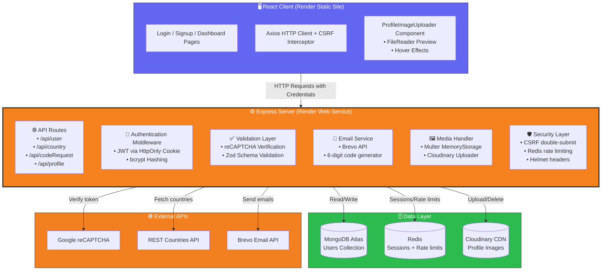

# Authentication-User-Dashboard-App

⭐ A production‑style full‑stack authentication system demonstrating secure user workflows, media uploads, and real‑world backend architecture.

A full‑stack authentication and user dashboard application built with **Node.js (Express)**, **MongoDB**, and **React**. This project implements secure authentication flows, CAPTCHA protection, **Cloudinary image upload**, interactive maps, and third‑party API integrations used in real‑world web applications.

[](LICENSE)
[](https://nodejs.org/)
[](https://expressjs.com/)
[](https://reactjs.org/)
[](https://vitejs.dev/)
[](https://mongodb.com/)
[](https://mongoosejs.com/en/)
[](https://jwt.io/)
[](https://cloudinary.com/)
[](https://www.google.com/recaptcha/)
[](https://axios-http.com/)
[](https://getbootstrap.com/)
[]()

---

## Table of Contents
- [Overview](#overview)
- [Deployment](#deployment)
- [Why This Project Exists](#why-this-project-exists)
- [Usage Example](#usage-example)
- [Architecture](#architecture)
- [Features](#features)
- [Tech Stack](#tech-stack)
- [Environment Variables](#environment-variables)
- [Project Structure](#project-structure)
- [Authentication Flows](#authentication-flows)
- [API Reference](#api-reference)
- [License](#license)

---

## Overview

This application implements a secure authentication system with:

- User signup with **email verification** (6-digit code, 10-minute TTL)
- CAPTCHA‑protected login
- Password reset via email verification code
- **Profile image upload** with Cloudinary CDN storage
- Protected user dashboard with profile management
- Country selection with live map preview
- **Interactive map** that auto-zooms to selected country

The goal is to simulate a realistic, production‑ready authentication architecture with modern media handling capabilities.

## Deployment
🚀 **Live Production Environment:** [https://authentication-user-dashboard-app.onrender.com](https://authentication-user-dashboard-app.onrender.com)

This application is fully decoupled and distributed on **Render**:
* **Frontend:** Hosted as a managed Static Site serving the Vite production build.
* **Backend:** Hosted as a Web Service running Node.js, connected to a **MongoDB Atlas** database cluster.
* **Media Storage:** User-uploaded profile images are stored and served via **Cloudinary** CDN.

---

<div align="center">
  
</div>
<div align="center">
  <em>Demonstration of signup with country selection and profile image upload</em>
</div>

---

## Why This Project Exists

This project is a **portfolio centerpiece** showcasing full‑stack capabilities:

| Area | What I Demonstrated |
|------|---------------------|
| **Backend** | Express REST API, JWT auth, bcrypt hashing, Brevo email, Zod validation, Multer file handling |
| **Frontend** | React 19 components, React Router, Axios interceptors, Bootstrap, Leaflet map embed, FileReader API |
| **Security** | HttpOnly cookies, double-submit CSRF, reCAPTCHA v2, bcrypt-hashed time-limited codes, Zod input validation, Helmet headers |
| **Media Management** | Cloudinary CDN integration, profile picture upload/delete, image optimization, Multer middleware |
| **Integrations** | REST Countries API, Google reCAPTCHA, Brevo email API, Cloudinary |
| **Database** | MongoDB schema design, Mongoose ODM, user data persistence |
| **DevOps** | Decoupled cross-origin cloud deployment, CORS configuration, Redis session + rate-limit store |

---

## Usage Example

1. **Sign up** – Enter your details, upload a profile picture (optional), and choose a country — the map auto‑zooms to your selection.
2. **Verify your email** – A 6-digit code is sent to your inbox. Enter it to activate your account and get logged in immediately.
3. **Log in** – Solve the reCAPTCHA, then receive a secure session via `httpOnly` cookie.
4. **Dashboard** – View your complete profile including email, username, country, join date, and profile image.
5. **Reset your password** – Request a 6‑digit verification code by email, verify it, then set a new password.
6. **Update profile** – Change your username, country, or profile picture (upload new or delete existing).

---

## Architecture



## Features

### 🔐 Authentication & Security
- **HttpOnly Cookie Sessions** – JWT stored exclusively in httpOnly cookies; never exposed to JavaScript.
- **Double-Submit CSRF Protection** – Every mutating request requires a valid CSRF token. The Axios client auto-fetches and caches the token, and retries automatically on a 403.
- **Email Verification** – 6-digit code sent via Brevo API on signup. Codes are bcrypt-hashed server-side and expire after 10 minutes.
- **CAPTCHA Protection** – Google reCAPTCHA v2 on login to prevent automated brute-force attempts.
- **Redis-Backed Rate Limiting** – Auth endpoints limited to 10 failed attempts per 15 minutes; email endpoints to 3 requests per hour. Counts only fail, not success.
- **Server‑Side Validation** – All inputs validated with Zod schemas before hitting the database.
- **Separate Reset JWT Secret** – Password reset tokens are signed with a dedicated `JWT_SECRET_RESET_PASSWORD`, isolated from the session secret.

### 👤 User Management
- **Password Reset Flow** – Time‑limited 6‑digit codes, bcrypt-hashed, sent via Brevo email API.
- **Interactive Dashboard** – Dynamic profile fetching with loading states and graceful error handling.
- **Profile Image Upload** – Upload, preview (with FileReader), and delete profile pictures stored on Cloudinary CDN.
- **Default Avatar Generation** – UI Avatars API fallback when no custom image is uploaded.

### 🗺️ Location & Maps
- **Country Integration** – Dynamic country list from REST Countries API, including flags.
- **Live Map Preview** – Leaflet map that auto-zooms to selected country coordinates.
- **Async Coordinate Fetching** – Country selection triggers background API call to update map viewport.

### 🎨 UI/UX Highlights
- **Polished Image Uploader** – Hover effects with SVG overlay, smooth transitions, and click-to-upload.
- **Responsive Design** – Bootstrap-powered layouts for desktop and mobile.
- **Loading States** – Spinners and disabled buttons during async operations.
- **Toast Notifications** – Success and error feedback via react-toastify.

---

## Tech Stack

| Layer | Technologies |
|----------------|------------------------------------------------------------------------------|
| **Frontend** | React 19, Vite 7, React Bootstrap, React Router 7, Axios, Leaflet, FileReader API |
| **Backend** | Node.js, Express 5, MongoDB (Mongoose 9), JWT, bcrypt, Zod, Multer |
| **Email** | Brevo API |
| **Media** | Cloudinary CDN (upload, storage, auto-optimization) |
| **Security** | Google reCAPTCHA v2, httpOnly cookies, CSRF double-submit, Redis rate limiting, Helmet |
| **Session Store** | Redis (via connect-redis + ioredis) |
| **APIs** | REST Countries API, Google reCAPTCHA API, Brevo API, Cloudinary API |

---

## Environment Variables

### Backend (`server/.env`)

```env
MONGODB_URI=mongodb+srv://...
JWT_SECRET=your_jwt_secret
JWT_SECRET_RESET_PASSWORD=your_reset_secret
SESSION_SECRET=your_session_secret
CSRF_SECRET=your_csrf_secret
CLOUDINARY_CLOUD_NAME=your_cloud_name
CLOUDINARY_API_KEY=your_api_key
CLOUDINARY_API_SECRET=your_api_secret
CAPTCHA_SECRET=your_recaptcha_secret
BREVO_API_KEY=your_brevo_key
BREVO_FROM_NAME=Your App Name
BREVO_FROM_EMAIL=noreply@yourdomain.com
PORT=3000
NODE_ENV=development
```

| Variable | Description |
|----------|-------------|
| `MONGODB_URI` | MongoDB Atlas connection string |
| `JWT_SECRET` | Secret for signing session JWTs |
| `JWT_SECRET_RESET_PASSWORD` | Separate secret for password reset tokens |
| `SESSION_SECRET` | Express session secret |
| `CSRF_SECRET` | Secret for CSRF double-submit token generation |
| `CLOUDINARY_CLOUD_NAME` | Cloudinary cloud name |
| `CLOUDINARY_API_KEY` | Cloudinary API key |
| `CLOUDINARY_API_SECRET` | Cloudinary API secret |
| `CAPTCHA_SECRET` | Google reCAPTCHA server-side secret key |
| `BREVO_API_KEY` | Brevo transactional email API key |
| `BREVO_FROM_NAME` | Sender display name for outgoing emails |
| `BREVO_FROM_EMAIL` | Sender email address for outgoing emails |
| `PORT` | Server port (defaults to 3000) |
| `NODE_ENV` | Set to `production` to enable secure cookies and rate limiting |

### Frontend (`client/.env`)

```env
VITE_API_URL=https://your-backend.onrender.com/api
VITE_REACT_APP_RECAPTCHA_SITE_KEY=your_recaptcha_site_key
VITE_GOOGLE_MAPS_API_KEY=your_google_maps_key
```

| Variable | Description |
|----------|-------------|
| `VITE_API_URL` | Base URL of the backend API |
| `VITE_REACT_APP_RECAPTCHA_SITE_KEY` | Google reCAPTCHA public site key |
| `VITE_GOOGLE_MAPS_API_KEY` | Google Maps JavaScript API key |

---

## Project Structure

```text
├── client/                            # React frontend
│   ├── src/
│   │   ├── api/
│   │   │   ├── apiClient.js           # Axios instance with CSRF interceptor + auto-retry
│   │   │   ├── userApi.js             # User CRUD operations
│   │   │   ├── countryApi.js          # Country data fetching
│   │   │   └── reqCodeApi.js          # Verification code + password reset endpoints
│   │   ├── components/
│   │   │   ├── ProfileImageUploader.jsx
│   │   │   ├── CountrySelector.jsx
│   │   │   ├── AccountFields.jsx
│   │   │   ├── SignupMap.jsx
│   │   │   ├── RecaptchaComponent.jsx
│   │   │   ├── Login.jsx
│   │   │   ├── Signup.jsx
│   │   │   ├── ResetPassword.jsx
│   │   │   ├── VerifyCard.jsx
│   │   │   ├── ConfirmationModal.jsx
│   │   │   └── pageContainer.jsx
│   │   ├── helper/
│   │   │   └── AuthContext.jsx        # Auth state context provider
│   │   ├── pages/
│   │   │   ├── loginPage.jsx
│   │   │   ├── signupPage.jsx
│   │   │   ├── homePage.jsx
│   │   │   ├── forgotPasswordPage.jsx
│   │   │   ├── verifyEmailPage.jsx
│   │   │   └── resetPasswordPage.jsx
│   │   ├── utils/
│   │   │   └── authUtils.js
│   │   ├── App.jsx
│   │   └── main.jsx
│   └── package.json
│
├── server/
│   ├── config/
│   │   ├── cloudinary.js              # Cloudinary upload/delete helpers
│   │   └── redis.js                   # ioredis client
│   ├── controllers/
│   │   └── emailSender.js             # Brevo email integration
│   ├── middleware/
│   │   ├── auth.js                    # JWT verification (cookie + Bearer header fallback)
│   │   ├── csrf.js                    # Double-submit CSRF setup
│   │   └── rateLimiter.js             # Redis-backed rate limiters
│   ├── models/
│   │   ├── user.js                    # Mongoose user schema
│   │   └── userZSchema.js             # Zod validation schema
│   ├── routes/
│   │   ├── user.js                    # Auth, profile management
│   │   ├── country.js                 # Country list, flags, coordinates
│   │   ├── codeRequest.js             # Email verification + password reset
│   │   └── profileImage.js            # Cloudinary upload/delete
│   └── index.js                       # Server entry point
│
├── tests/
│   └── 00-createAccount.spec.ts       # Playwright e2e test
└── README.md
```

---

## Authentication Flows

### Signup & Email Verification
1. User enters email, username, password, and selects a country. Optionally uploads a profile picture.
2. On submit, the client fetches a CSRF token, then posts registration data to `/api/user/storeRegistrationData`. This creates an unverified placeholder user in MongoDB and stores a bcrypt-hashed 6-digit code with a 10-minute TTL.
3. A verification code is sent to the user's email via Brevo.
4. User enters the code on the verification screen. Server validates the bcrypt hash and, on success, flips `email_verified` to `true`, issues a session JWT via httpOnly cookie, and returns the user object. The user is immediately logged in.
5. If a profile image was selected during signup, it is uploaded to Cloudinary via the temporary-user image endpoint.

### Login
1. User submits email, password, and reCAPTCHA token.
2. Server validates the reCAPTCHA with Google's API.
3. Unverified accounts (`email_verified: false`) are rejected with a 403.
4. Password compared against the bcrypt hash in MongoDB.
5. On success, a JWT is signed and stored in an httpOnly, SameSite=None cookie. No token is stored in JavaScript-accessible storage.

### CSRF Protection
All mutating requests (POST, PUT, DELETE) require a valid `x-csrf-token` header. The Axios client in `apiClient.js` caches the CSRF token for 4 minutes and refreshes it automatically. If a request returns 403, the interceptor forces a token refresh and retries the request once transparently.

### Password Reset
1. User requests a reset with their email address.
2. Server generates a 6-digit code, bcrypt-hashes it, stores it with a 10-minute TTL, and sends it via Brevo.
3. User submits the code. Server validates the hash and issues a short-lived JWT signed with `JWT_SECRET_RESET_PASSWORD` (15-minute expiry).
4. User sets a new password. Server verifies the reset token, bcrypt-hashes the new password, and saves it. The verification code is cleared.

---

## API Reference

See [API.md](API.md) for full endpoint documentation including request/response formats, auth requirements, and error codes.

---

## License

This project is licensed under the MIT License. See the [LICENSE](LICENSE) file for details.

---

Built by [Mel000000](https://github.com/Mel000000)
