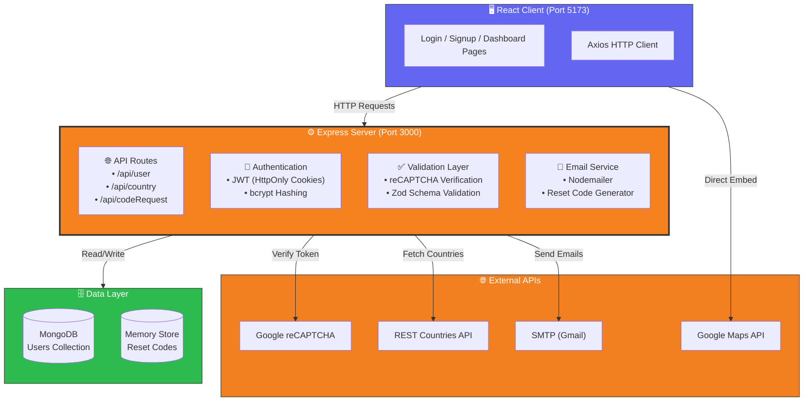

# Authentication-User-Dashboard-App

⭐ A production‑style full‑stack authentication system demonstrating secure user workflows and real‑world backend architecture.

A full‑stack authentication and user dashboard application built with **Node.js (Express)**, **MongoDB**, and **React**. This project implements secure authentication flows, CAPTCHA protection, and third‑party API integrations used in real‑world web applications.

[](LICENSE)
[](https://nodejs.org/)
[](https://expressjs.com/)
[](https://reactjs.org/)
[](https://vitejs.dev/)
[](https://mongodb.com/)
[](https://mongoosejs.com/)
[](https://jwt.io/)
[](https://axios-http.com/)
[](https://getbootstrap.com/)
[]()
---

## Table of Contents
- [Overview](#overview)
- [Why This Project Exists](#why-this-project-exists)
- [Usage Example](#usage-example)
- [Architecture](#architecture)
- [Features](#features)
- [Tech Stack](#tech-stack)
- [Environment Variables](#environment-variables)
- [Project Structure](#project-structure)
- [Authentication Flows](#authentication-flows)
- [API Endpoints](#api-endpoints)
- [Roadmap](#roadmap)
- [License](#license)

---

## Overview

This application implements a secure authentication system with:

- User signup & login
- CAPTCHA‑protected login
- Password reset via email code
- JWT stored in **HttpOnly cookies**
- Protected user dashboard
- Country selection with live Google Maps preview

The goal is to simulate a realistic, production‑ready authentication architecture.

---

<div align="center">
  
</div>

---
## Why This Project Exists

This project is a **portfolio centerpiece** showcasing my full‑stack capabilities:

| Area | What I Demonstrated |
|------|---------------------|
| **Backend** | Express REST API, JWT auth, bcrypt hashing, Nodemailer, Zod validation |
| **Frontend** | React components, React Router, Axios, Bootstrap, Google Maps embed |
| **Security** | HttpOnly cookies, reCAPTCHA, time‑limited codes, input validation |
| **Integrations** | REST Countries API, Google Maps API, SMTP email service |
| **Database** | MongoDB schema design, Mongoose ODM, user data persistence |
| **DevOps** | Environment variables, Git structure, Vite build tooling |

---

## Usage Example

1. **Sign up** – Choose a country, and the map auto‑zooms to it.
2. **Log in** – Solve the reCAPTCHA, receive an `HttpOnly` cookie.
3. **Dashboard** – View your profile (email, username, country, join date).
4. **Login by Email-Verification** – Receive a 6‑digit code by email.

## Architecture


## Features

- Secure Authentication – Password hashing (bcrypt), JWT in HttpOnly cookies, protected routes.
- CAPTCHA Protection – Google reCAPTCHA v2 on login to prevent brute force.
- Password Reset – Time‑limited 6‑digit codes sent via email.
- Interactive Dashboard – View and manage profile information.
- Country Integration – Dynamic country list from REST API; Google Map auto‑zooms to selected country.
- Email Service – Nodemailer with Gmail SMTP.
- Server‑Side Validation – Zod schemas for all incoming data.

## Tech Stack

| Layer         | Technologies                                                                 |
|---------------|-------------------------------------------------------------------------------|
| **Frontend**  | React, Vite, React Bootstrap, React Router, Axios, Google Maps API           |
| **Backend**   | Node.js, Express, MongoDB (Mongoose), JWT, bcrypt, Zod, Nodemailer, CORS     |


## Environment Variables

### Backend (`server/.env`)

| Variable         | Description                          |
|------------------|--------------------------------------|
| `MONGO_URI`      | Your MongoDB connection string       |
| `JWT_SECRET`     | Secret for signing JWTs              |
| `EMAIL_USER`     | Gmail address (or SMTP user)         |
| `EMAIL_PASS`     | Gmail App Password                   |
| `CAPTCHA_SECRET` | Google reCAPTCHA secret key          |

### Frontend (`client/.env`)

| Variable                               | Description                     |
|----------------------------------------|---------------------------------|
| `VITE_REACT_APP_RECAPTCHA_SITE_KEY`    | Google reCAPTCHA site key       |
| `VITE_GOOGLE_MAPS_API_KEY`             | Google Maps API key             |

> ⚠️ Never commit `.env` files. They are already in `.gitignore`.

## Project Structure

```text
├── client/                 # React frontend
│   ├── src/
│   │   ├── api/           # Axios API calls (user, country, codeRequest)
│   │   ├── assets/        # Images (default profile, hover effect)
│   │   ├── components/    # Reusable components (Login, Signup, Map, etc.)
│   │   ├── pages/         # Route pages (Dashboard, SignupPage, etc.)
│   │   └── main.jsx / App.jsx
│   ├── .env
│   └── package.json
│
├── server/                 # Express backend
│   ├── controllers/       # Email sending logic
│   ├── models/            # Mongoose schemas + Zod validation
│   ├── routes/            # API endpoints (country, user, codeRequest)
│   ├── .env
│   └── index.js           # Server entry point
│
└── README.md
```

## Authentication Flows
### Signup
1. User fills form (username, email, password, country).
2. Profile image preview (client‑side only).
3. On submit, password is hashed with bcrypt and user is stored in MongoDB.
4. (Email verification can be added, currently auto‑verified for demo.)

### Login
1. User provides email + password.
2. reCAPTCHA is validated.
3. On success, server issues a JWT and stores it in an HttpOnly cookie.
4. Client is redirected to /home.

### Password Reset
1. User requests reset via email.
2. Backend generates a 6‑digit code and sends it via SMTP.
3. User enters code → if valid, they get signed in.

## API Endpoints

| Method | Endpoint                     | Description                              | Auth |
|--------|------------------------------|------------------------------------------|------|
| POST   | `/api/user/createUser`       | Register new user                        | No   |
| POST   | `/api/user/loginUser`        | Login + reCAPTCHA validation             | No   |
| GET    | `/api/user/me`               | Get current user (requires cookie)       | Yes  |
| POST   | `/api/user/logout`           | Clear auth cookie                        | Yes  |
| POST   | `/api/codeRequest`           | Request password reset code              | No   |
| POST   | `/api/codeRequest/verifyCode`| Verify reset code                        | No   |
| GET    | `/api/country/all`           | Get list of all country names            | No   |
| GET    | `/api/country/:value`        | Get lat/lng for a country                | No   |

## Roadmap
- Profile image upload to Cloudinary (currently client‑side only)
- Persistent email verification (send verification link)
- Rate limiting on auth endpoints
- Refresh token rotation
- Store reset codes in Redis instead of memory
- Deploy to Render (backend) + Vercel (frontend) + MongoDB Atlas

## License
This project is licensed under the MIT License. See the LICENSE file for details.

## About
Built by Mel000000 – a production‑style authentication demo with real‑world security patterns.
